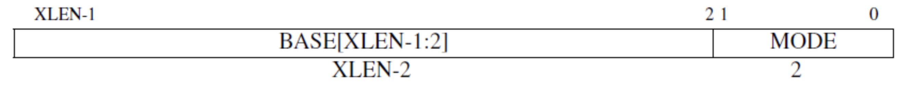

# 处理异常

> 本章代码对应 commit ：???

## 概要

CPU 运行到一些情况下会产生**异常（exception）**，例如访问无效的内存地址、执行非法指令、发生缺页等。用户程序进行**系统调用（syscall）**，或程序运行到**断点（breakpoint）**时，也会主动触发异常。

和异常类似的一个概念是**中断（interrupt）**。中断指的是 CPU 运行过程被**外部信号**打断，这些信号一般由 CPU 之外的硬件产生，表示某些事件发生，例如定时器倒计时结束、串口收到数据等。

当发生中断或异常时，CPU 会立即跳转到一个预先设置好的地址，执行中断处理程序，最后恢复原程序的执行。

本章中我们会实现一个简单的中断处理程序，具体分为以下部分：

1. 设置中断入口点
2. 创建 **中断帧（TrapFrame）** 结构体
3. 在中断处理程序中保存和恢复寄存器
4. 进行具体的中断处理

## RISCV 中断处理过程

在 RISCV 特权指令集手册中，描述了与中断处理相关的 CSR 寄存器：

* sscratch：一个字的临时存储空间，一般用来辅助中断处理
* sstatus：系统状态寄存器
* stvec：中断跳转地址
* scause：中断或异常的原因
* sepc：发生中断时的位置 / PC

与中断相关的指令：

* sret：S态中断返回
* ecall：向底层执行环境发出调用请求，用来进行系统调用
* ebreak：触发断点异常

> TODO：具体描述中断行为

## 设置中断入口点

当我们的程序遇上中断或异常时， CPU 会跳转到一个指定的地址进行中断处理。在 RISCV 中，这个地址由 **stvec** 控制寄存器保存：



stvec 中包含了 **基址（BASE）** 和 **模式（MODE）**两部分 ，其中 **基址（BASE）** 必须按照 4 字节对齐。

RISCV 中有两种中断入口模式：

- **直接模式（Driect）**
  MODE = 0 ，触发任何 **中断异常** 时都把 PC 设置为 BASE
- **向量模式（Vectored）**
  MODE = 1 ，对第 i 种 **中断** ，跳转到 `BASE + i * 4`；对所有 **异常** ，仍跳转到 BASE

为了实现简单，我们采用第一种模式，先进入统一的处理函数，之后再根据中断/异常种类进行不同处理。

由于接下来的代码涉及 riscv 相关寄存器的操作，我们首先在 `Cargo.toml` 中引入 `riscv` 库：

```rust
[dependencies]
riscv = { git = "https://github.com/rcore-os/riscv", rev = "c62af46", features = ["inline-asm"] }
```

在 ` main.rs` 的同级目录下创建 `interrupt.rs` 用于处理中断。我们首先写一个最简单的中断处理函数 `trap_handler`，在其中读取并打印 `scause` 和 `sepc` 寄存器。然后设置 `stvec` 寄存器指向这个函数地址：

```rust
use riscv::register::{scause, sepc, stvec};

pub fn init() {
    unsafe {
        stvec::write(trap_handler as usize, stvec::TrapMode::Direct);
    }
    println!("++++setup interrupt !++++");
}

fn trap_handler() -> ! {
    let cause = scause::read().cause();
    let epc = sepc::read();
    println!("trap: cause: {:?}, epc: {:#x}", cause, epc);
    panic!("trap");
}
```

由于现在还无法恢复中断，我们用 panic 结束这个函数，并用`-> !`标记此函数永不返回。

接下来我们修改 `main.rs`，在主函数中初始化中断，然后触发一个断点异常：

```rust
mod interrupt;

#[no_mangle]
pub extern "C" fn rust_main() -> ! {
    interrupt::init();
    unsafe {
        riscv::asm::ebreak();
    }
    panic!("End of rust_main");
}
```

`make qemu` 运行，我们看到程序成功触发了异常并进入了处理函数：

```
++++setup interrupt !++++
trap: cause: Exception(Breakpoint), epc: 0x8040224c
panicked at 'trap', src/interrupt.rs:14:5
```

## 创建中断帧结构体

上面这个简单的中断处理函数无法返回，原因是处理函数会覆盖掉原有的寄存器信息。为了能够恢复中断之前的状态，我们需要保存当前 **所有寄存器** 的状态，然后处理中断，最后恢复寄存器状态，继续执行之前的命令。我们需要按照特定的格式保存寄存器，以便于我们使用 **中断帧（TrapFrame）** 结构体查看或修改这些寄存器。可以理解为，在一片连续的内存空间中存放了我们寄存器的状态，我们通过这片空间的首地址（指针）来访问他们。

**riscv32** 中有 32 个通用寄存器和部分特殊寄存器。在 main.rs 的同级目录下创建 `context.rs` 文件，在开头引入一些特殊寄存器：

```rust
use riscv::register::{
    sstatus::Sstatus,
    scause::Scause,
};
```

栈帧结构体的实现如下：

```rust
#[repr(C)]
pub struct TrapFrame {
    pub x: [usize; 32], 	// 通用寄存器
    pub sstatus: Sstatus, 	// 状态寄存器
    pub sepc: usize, 		// 中断地址
    pub stval: usize, 		// 中断相关值
    pub scause: Scause, 	// 中断原因
}
```

其中 `#[repr(C)]` 表示对这个结构体按 **C 语言标准** 进行内存布局，也就是从起始地址开始，按字段的定义顺序依次排列。如果不写的话，Rust 对它的内存布局是不确定的。

接下来我们将进入中断处理中最硬核的部分：编写一段汇编来保存和恢复寄存器！

## 保存和恢复寄存器

我们创建一个 `trap.asm` 文件，首先编写中断处理的整体框架：

```nasm
# in trap.asm

	.section .text			# 声明接下来的内容是代码段
	.globl __alltraps		# 声明__alltraps是全局符号，可以被外部访问到
__alltraps:					# 定义__alltraps符号，作为中断入口点
    SAVE_ALL				# 保存寄存器过程，后文中定义
    mv a0, sp				# 将栈指针 sp 复制到 a0，作为下面函数的第一个参数
    jal rust_trap			# 调用 Rust 中的处理函数
__trapret:					# 中断恢复入口点，rust_trap 返回到这里
    RESTORE_ALL				# 恢复寄存器过程，后文中定义
    sret					# 中断返回指令
```

为了增加代码的可读性，我们还定义了一些宏：

```nasm
# in trap.asm

.equ XLENB, 4				# 字长为 4 Byte
.macro LOAD a1, a2			# 读取内存地址 sp+a2*4 的值到寄存器 a1
    lw \a1, \a2*XLENB(sp)
.endm
.macro STORE a1, a2			# 将寄存器 a1 的值保存到内存地址 sp+a2*4
    sw \a1, \a2*XLENB(sp)
.endm
```

接下来是 `SAVE_ALL` 保存寄存器的过程：

```nasm
.macro SAVE_ALL
    # If coming from userspace, preserve the user stack pointer and load
    # the kernel stack pointer. If we came from the kernel, sscratch
    # will contain 0, and we should continue on the current stack.
    csrrw sp, sscratch, sp
    bnez sp, trap_from_user
trap_from_kernel:
    csrr sp, sscratch
    # sscratch = previous-sp, sp = kernel-sp
trap_from_user:
    # provide room for trap frame
    addi sp, sp, -36*XLENB
    # save x registers except x2 (sp)
    STORE x1, 1
    STORE x3, 3
    STORE x4, 4
    STORE x5, 5
    STORE x6, 6
    STORE x7, 7
    STORE x8, 8
    STORE x9, 9
    STORE x10, 10
    STORE x11, 11
    STORE x12, 12
    STORE x13, 13
    STORE x14, 14
    STORE x15, 15
    STORE x16, 16
    STORE x17, 17
    STORE x18, 18
    STORE x19, 19
    STORE x20, 20
    STORE x21, 21
    STORE x22, 22
    STORE x23, 23
    STORE x24, 24
    STORE x25, 25
    STORE x26, 26
    STORE x27, 27
    STORE x28, 28
    STORE x29, 29
    STORE x30, 30
    STORE x31, 31

    # get sp, sstatus, sepc, stval, scause
    # set sscratch = 0
    csrrw s0, sscratch, x0
    csrr s1, sstatus
    csrr s2, sepc
    csrr s3, stval
    csrr s4, scause
    # store sp, sstatus, sepc, sbadvaddr, scause
    STORE s0, 2
    STORE s1, 32
    STORE s2, 33
    STORE s3, 34
    STORE s4, 35
.endm
```

一上来我们就遇到一个尴尬的局面：中断可能来自用户态（U-Mode），也可能来自内核态（S-Mode）。如果是用户态中断，那么此时的栈指针 sp 指向的是用户栈；如果是内核态中断，那么 sp 指向的是内核栈。现在我们希望把寄存器保存在内核栈上， 这就要求**有一个通用寄存器指向内核栈**。对于内核态中断来说，直接使用 sp 就可以了，**但对于用户态中断，我们需要在不破坏 32 个通用寄存器的情况下，切换 sp 到内核栈。**

解决问题的关键是要有一个可做交换操作的临时寄存器，这里就是 `sscratch`。

我们规定：**当 CPU 处于 U-Mode 时，`sscratch` 保存内核栈地址；处于 S-Mode 时，`sscratch` 为0。**

接下来我们考察中断处理的前三条指令，它们利用 `sscratch` 的性质巧妙地完成了切换栈的操作：

```asm
    # 交换 sp 和 sscratch 寄存器
    csrrw sp, sscratch, sp
    # 判断 sp（也就是交换前的 sscratch）是否为0
    # 如果非0，说明是用户态中断，由于 sscratch 保存的是内核栈地址
    # 此时 sp 已经指向内核栈，直接跳转到 trap_from_user 保存寄存器
    bnez sp, trap_from_user
    # 否则说明是内核态中断
trap_from_kernel:
	# 只需从 sscratch 中读出原来的 sp 即可
    csrr sp, sscratch
    # 此时 sscratch = 发生中断前的 sp
    #     sp = 内核栈
trap_from_user:
```

后面的事情就比较简单了：此时 sp 指向的是内核栈的栈底，接下来我们要把 TrapFrame 保存在栈上，因此先将它下移相当于 TrapFrame 大小的距离（36 * 4 Byte），然后依次保存除 x0 和 sp (x2) 外的 30 个通用寄存器：

```assembly
trap_from_user:
    # 为 TrapFrame 预留空间
    addi sp, sp, -36*XLENB
    # 保存通用寄存器（sp 除外）
    STORE x1, 1
    STORE x3, 3
    STORE x4, 4
    ...
    STORE x31, 31
```

x0 永远是0，不用保存；sp 本应保存的是发生中断前的值，这个值目前被交换到了 sscratch 中，因此留到后面处理。

接下来保存 CSR 寄存器，此时通用寄存器已经可以随意使用了：

```assembly
    # 读取 sp, sstatus, sepc, stval, scause
    # 按照规定，进入内核态后 sscratch 应为 0
    csrrw s0, sscratch, x0		
    csrr s1, sstatus
    csrr s2, sepc
    csrr s3, stval
    csrr s4, scause
    # 保存 sp, sstatus, sepc, stval, scause
    STORE s0, 2
    STORE s1, 32
    STORE s2, 33
    STORE s3, 34
    STORE s4, 35
```

`SAVE_ALL` 就这样结束了，紧接着两条指令让我们跳转到 Rust 代码：

```assembly
	mv a0, sp
    jal rust_trap
```

**a0** 是 riscv32 中的参数寄存器，用于存放下一个调用的函数的参数。我们给 **a0** 赋值为 **sp** ，也就是中断帧的地址。这里调用的函数是 `rust_trap` 。`interrupt.rs` 需要稍作改动：

```rust
// in interrupt.rs

pub fn init() {
    extern {
        fn __alltraps();	// 导入汇编中的符号
    }
    unsafe {
		sscratch::write(0);	// 初始化 sscratch 为 0
        stvec::write(__alltraps as usize, stvec::TrapMode::Direct);
    }
    println!("++++setup interrupt !++++");
}

// 导入汇编文件
global_asm!(include_str!("trap/trap.asm"));

#[no_mangle]
pub extern "C" fn rust_trap(tf: &mut TrapFrame) -> ! {
    println!("trap: {:#x?}", tf);
    panic!("trap");
}
```

编译运行，得到以下输出：

```
++++setup interrupt !++++
trap: TrapFrame {
    x: [
        0x8040736c,
        0x80401f50,
        0x80418ff0,
        0x0,
        0x8001af00,
        0x8001ae50,
        0x0,
        0x0,
        0x80419000,
        0x8001af00,
        0x0,
        0x0,
        0x0,
        0x0,
        0x0,
        0x0,
        0x80418fc8,
        0x1,
        0x80008500,
        0x0,
        0x0,
        0x0,
        0x0,
        0x8,
        0x2000,
        0x0,
        0x0,
        0x0,
        0x0,
        0x0,
        0x1,
        0x0
    ],
    sstatus: Sstatus {
        bits: 0x80006100
    },
    sepc: 0x80401f54,
    stval: 0x0,
    scause: Scause {
        bits: 0x3
    }
}
panicked at 'trap', src/interrupt.rs:20:5
```

我们成功保存了发生中断时寄存器的值！

恢复寄存器 `RESTORE_ALL` 的过程正好相反。首先根据 `sstatus` 寄存器中的 `SPP` 位，判断是回到用户态还是内核态。如果是回到用户态，根据规定需要设置 `sscratch` 为内核栈：

```assembly
    LOAD s1, 32             # s1 = sstatus
    LOAD s2, 33             # s2 = sepc
    andi s0, s1, 1 << 8     # sstatus.SPP = 1?
    bnez s0, _to_kernel     # s0 = back to kernel?
_to_user:
    addi s0, sp, 36*XLENB
    csrw sscratch, s0         # sscratch = kernel-sp
_to_kernel:
```

然后就是依次恢复 CSR 和通用寄存器了：

```assembly
_to_kernel:
    # restore sstatus, sepc
    csrw sstatus, s1
    csrw sepc, s2

    # restore x registers except x2 (sp)
    LOAD x1, 1
    LOAD x3, 3
    LOAD x4, 4
    ...
    LOAD x31, 31
    # restore sp last
    LOAD x2, 2
```

最后通过 `sret` 指令完成中断返回：CPU 根据 `sstatus.SPP` 确定特权级，将 `sepc` 恢复到 PC。

我们修改一下 `rust_main` ：

```rust
#[no_mangle]
pub extern "C" fn rust_trap(tf: &mut TrapFrame) {
    println!("trap!");
}
```

再运行一下，发现程序不断地输出 `trap!` ，说明中断恢复没有问题。

## 进行中断处理

至此我们已经为真正的中断处理函数 `rust_trap` 建立好了执行环境，免除了恢复中断现场的后顾之忧。后面我们会陆续添加对不同中断和异常种类的处理逻辑。

眼下我们要处理的是断点异常 `Breakpoint`！

在 riscv 中，发生中断指令的 `pc` 被存入 `sepc` 。对于大部分情况，中断处理完成后还回到这个指令继续执行。但对于用户主动触发的异常（例如 `ebreak` 用于触发断点，`ecall` 用于系统调用），中断处理函数需要调整 `sepc` 以跳过这条指令。在 riscv 中， **一般** 每条指令都是定长的 4 字节（但如果开启 **压缩指令集** 可就不一定了，这也导致了一个大坑），因此只需将 `sepc` +4 即可，这里我们通过 `increase_sepc` 完成这个功能：

```rust
// in context.rs

impl TrapFrame {
    pub fn increase_sepc(&mut self) {
        self.sepc += 4;
    }
}

// in interrupt.rs

#[no_mangle]
pub extern "C" fn rust_trap(tf: &mut TrapFrame) {
    println!("trap!");
    tf.increase_sepc();
}
```

**注意！！！**

这里我们强调了 **一般** 。在开启 **压缩指令集** 的情况下，对于常用指令，编译器会进行压缩，减小程序的大小。但是有时候这并不是我们希望的。比如这里因为我们要求每条指令都是精准的 **32bits** ，才能够通过 `self.sepc += 4` 跳转至下一条指令（否则会跳转到奇怪的地方）。在 **riscv32-os.json** 中，有一行 `"features": "+m,+a,+c"` 。默认情况下，riscv 指令集只支持加减法， **+m** 增加了乘除指令； **+a** 增加了原子操作； **+c** 增加了代码压缩。这里的压缩是我们不想要的，所以把 **+c** 删去。

至此我们简易的的中断功能已经全部实现完成！编译运行，屏幕显示：

```
++++setup interrupt !++++
trap!
panicked at 'End of rust_main', src/main.rs:51:5
```

## 预告

现在，我们已经实现了简易的中断机制。但是同时我们的 **main.rs** 看起来有一些乱。下一章，我们首先将调整代码结构，简化 **main.rs** ，然后实现时钟中断，并在 **rust_trap** 中区分中断类型，对他们进行不同的处理。
